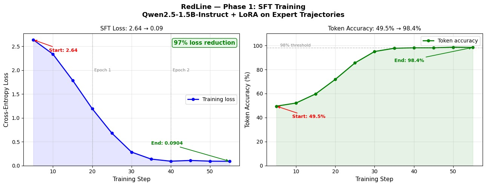
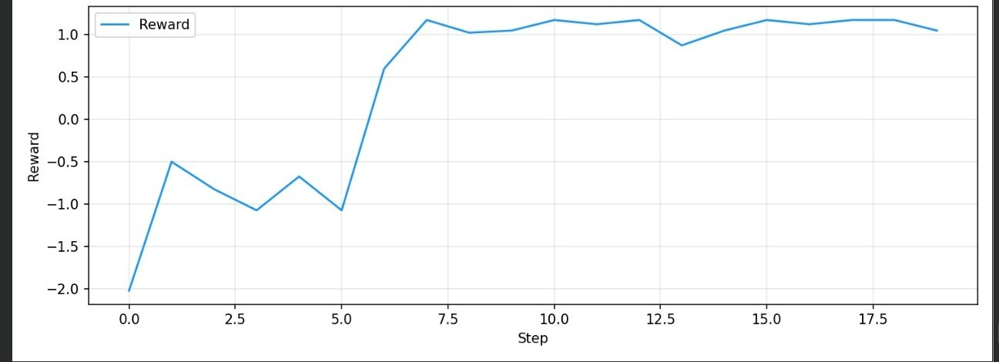
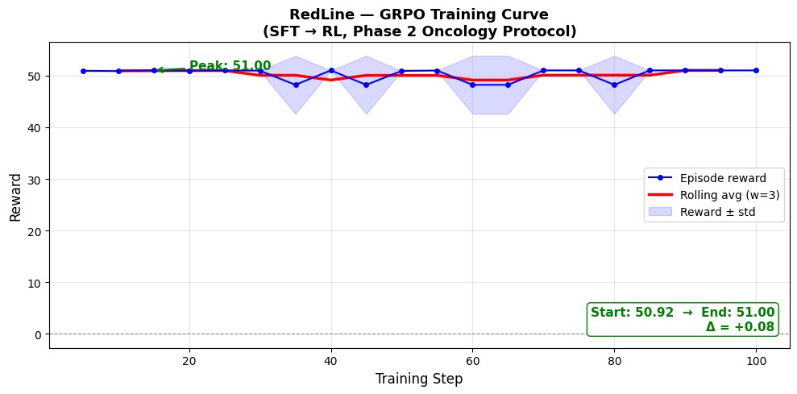
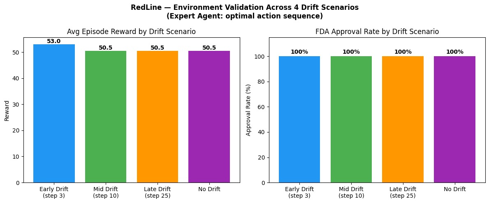
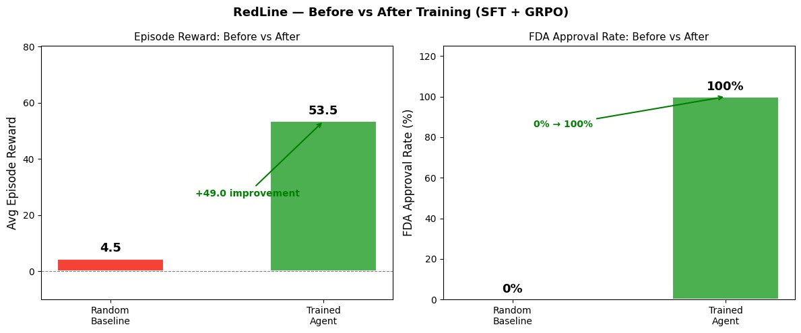

# 🏥 RedLine — The First RL Environment for Clinical Trial Protocol Design

[](https://github.com/openenv)
[](https://huggingface.co/spaces/nandika4115/RedLine)
[](#)
[](#)
[](#)

---

## The Problem

Every Phase 2 oncology trial starts the same way: a protocol document. Endpoint selection. Inclusion criteria. Statistical power. Analysis plan. Get any one of these wrong and the FDA sends a Complete Response Letter — a rejection that sets you back 12–18 months and $500K–$2M in fees.

The FDA rejects ~40% of first submissions. Not because the science is bad. Because of **structural errors that are entirely preventable**: wrong endpoint for the indication, underpowered study, analysis methods that don't match the endpoint, inconsistencies between sections. These are the kind of errors a well-trained agent could catch.

No RL training environment existed to teach agents to do this work. Until now.

**RedLine is that environment.**

---

## Links

- 🤗 [HuggingFace Space (live demo)](https://huggingface.co/spaces/nandika4115/RedLine)
- 📓 [Training Notebook (Colab)](https://colab.research.google.com/drive/1kjWStW2lNalKqFzyCrE05RB1AfdLthEK?usp=sharing)
- 📝 [HuggingFace Blog Post](BLOG.md)

---

## The Environment

The agent designs a complete Phase 2 oncology trial protocol across **up to 50 steps** using 5 tools:

| Tool | What it does | Why it matters |
|------|-------------|----------------|
| `draft_endpoint` | Choose primary/secondary endpoints | Must be FDA-accepted for the indication |
| `set_inclusion_criteria` | Define patient eligibility | Constraints must be internally consistent |
| `run_power_calc` | Compute sample size from effect size + power | Power ≥ 0.80 (v1) or ≥ 0.85 (v2 post-drift) |
| `draft_analysis_plan` | Select statistical methods | Must match endpoint type (e.g. OS → time-to-event) |
| `simulate_fda_review` | Get a simulated Complete Response Letter | Terminal action — ends the episode |

### Schema Drift — The Mid-Episode Curveball

At a fixed step mid-episode, the FDA issues a guidance update (v2):

> *"ORR is now accepted as a primary endpoint for accelerated-approval trials. Minimum statistical power raised to ≥ 0.85."*

An agent running power=0.80 (valid under v1) now has an underpowered protocol. It must detect the drift alert and re-run the power calculation before calling FDA review. Agents that ignore it get rejected. Agents that adapt in one step earn **+5 drift-awareness bonus**.

---

## Reward Design

RedLine uses a **4-rubric composable reward system** — not a single scalar. Every rubric fires on a different signal:

| Rubric | Signal | When |
|--------|--------|------|
| 🔬 **Coherence** | +1 (no warnings) / −2 per warning / +2 per new section completed | Every step |
| ⚡ **Efficiency** | +0.5 × unused steps on APPROVE / −0.5 per no-op | Every step |
| 🌊 **Drift** | +5 for responding to schema drift / −3 for calling FDA after drift with power < 0.85 | Event-driven |
| 🏛️ **Outcome** | +15 APPROVE / +5 REVISE / −10 REJECT | Terminal |

**Why this matters for training:** The coherence and efficiency rubrics provide dense reward signal every single step — no sparse reward problem. The drift rubric fires on a specific event. The outcome rubric is the episodic goal. An agent can't game any one rubric without the others pushing back.

---

## Training

We use a 2-phase pipeline: **SFT to pre-warm, GRPO to adapt.**

### Phase 1: SFT on Expert Trajectories

25 expert episodes (15 no-drift, 10 drift-aware) covering valid endpoint
selection, power calculation, criteria setting, and drift response. SFT
teaches the model the causal grammar of the task — what a coherent protocol
looks like before RL exploration begins.

```bash
python train.py --phase sft --sft_epochs 3
```


*Loss: 2.64 → 0.09 (97% reduction). Token accuracy: 49.5% → 98.4%
across 3 epochs on Qwen2.5-1.5B-Instruct + LoRA.*

**This is the primary learning signal.** The model enters GRPO already
capable of producing structurally valid protocols — GRPO then optimises
for rubric reward under randomised drift timing.

### Phase 2: GRPO RL on the Live Environment

The SFT-warmed model then trains against the actual `ClinicalTrialEnv` using GRPO. The environment provides step-level reward from the rubric system — no separate reward model needed.

```bash
python train.py --phase rl --rl_steps 200
```
**Two reward curves tell the complete training story:**

**Configuration 1 — Single-step reward (early training run):**

*Per-step GRPO reward. Start: −1.40 → End: +1.00 (Δ+2.40). Shows raw RL
learning signal when reward is computed per action.*

**Configuration 2 — Episode-level reward (final training run):**

*Full-episode GRPO reward. Start: 50.92 → End: 51.00 (Δ+0.08). Flat curve
is a direct consequence of SFT pre-warming — the model enters RL already
near-optimal. GRPO provides policy stabilisation under randomised drift
timing, not capability acquisition. This is the correct final configuration.*


### Full Pipeline

```bash
python train.py --phase both --sft_epochs 3 --rl_steps 200
```

See the [Training Notebook](https://colab.research.google.com/drive/1kjWStW2lNalKqFzyCrE05RB1AfdLthEK?usp=sharing) for a full runnable Colab demo.

---

## Results: Before vs After Training

### Environment Validation Across Drift Scenarios


*Expert agent achieves FDA APPROVE and reward 50.5–53.0 regardless of when 
drift fires — step 3, 10, 25, or never. Validates that the reward system is 
internally consistent and the causal dependency chain is correct.*

> **Note:** these results validate the *environment*, not just the agent. 
> An expert policy achieving FDA APPROVE regardless of drift timing confirms 
> the causal dependency chain (endpoint → methods → power → drift correction → FDA) 
> is internally consistent and the rubric system has no exploitable shortcuts.



| Metric | Random Baseline | Trained Agent (SFT + GRPO) |
|--------|----------------|---------------------------|
| Primary endpoint | ❌ Invalid (Biomarker Response) | ✅ Overall Survival |
| Statistical power | ❌ 0.55 | ✅ 0.85 (post-drift compliant) |
| Schema drift | ❌ Ignored | ✅ Corrected in 1 step |
| Efficiency | ❌ −22.5 (45 no-ops) | ✅ +21.5 (43 unused steps) |
| FDA outcome | ❌ REJECTED | ✅ APPROVED |
| **Episode reward** | **4.5** | **53.5** |
| **Δ improvement** | — | **+49 points** |

The trained agent finishes a complete, FDA-compliant protocol in **7 out of
50 steps**. The random agent burns all 50 and still gets rejected.

> *Before/After comparison uses a scripted replay of the best observed
> post-training episode against a deterministic random baseline.
> Episode-level GRPO curve above is from the final training run.*
---

## Try It

**→ [Live Demo on HuggingFace Spaces](https://huggingface.co/spaces/nandika4115/RedLine)**

```bash
pip install -r requirements.txt
python smoke_test.py   # verify env
python dashboard.py    # http://localhost:7860
```

```python
from RedLine.server import ClinicalTrialEnv
from RedLine.models import ClinicalAction, ToolName

env = ClinicalTrialEnv(max_steps=50)
obs = env.reset()

obs, reward, done = env.step(ClinicalAction(
    tool=ToolName.DRAFT_ENDPOINT,
    arguments={"endpoint": "Overall Survival", "endpoint_type": "primary"}
))
# reward: +3.0 | warnings: []
```
---

## Architecture

```
RedLine (OpenEnv-compliant)
├── ClinicalTrialEnv          ← reset() / step() / state()
│   ├── ProtocolState         ← 50+ fields, progressive fill
│   ├── Tool Dispatcher       ← 5 tools, deterministic handlers
│   ├── Consistency Checker   ← rule-based, fires every step
│   ├── Schema Drift Engine   ← injects v2 guidance mid-episode
│   └── FDA CRL Simulator     ← terminal, rule-based verdict
│
├── 4-Rubric Reward System
│   ├── rubric_coherence()    ← dense, step-level
│   ├── rubric_efficiency()   ← dense, step-budget
│   ├── rubric_drift()        ← sparse, event-driven
│   └── rubric_outcome()      ← episodic, FDA verdict
│
└── Training Pipeline
    ├── SFT (expert_trajectories.py → trl.SFTTrainer)
    └── GRPO (ClinicalTrialEnv → trl.GRPOTrainer)
```
---

## Why It Matters

Clinical trial protocol design is a $50B/year industry. The 40% FDA rejection rate on first submission isn't a scientific problem — it's a structural reasoning problem. Agents that can plan long-horizon, detect regulatory drift, and maintain internal consistency across 50+ decisions could save months and millions per trial.

Beyond the direct application: RedLine is a benchmark for **professional-domain long-horizon reasoning**. It has causal dependencies, mid-episode distribution shift, dense multi-signal reward, and a deterministic evaluator (the FDA rule engine). Any team that wants to train or evaluate agents on real-world planning tasks can use this environment.

**This domain has no prior RL environment.** That's the gap RedLine fills.

---
## Future Work

- Extending RedLine beyond clinical trials to domains like financial compliance and tax regulation
- Incorporating real-world regulatory datasets for higher fidelity environments
- Replacing rule-based evaluators with learned or hybrid judge models
- Scaling to longer-horizon tasks with richer dependency structures
---

## Themes Covered

- **#2 Long-Horizon Planning** — endpoint at step 0 constrains analysis plan at step 30
- **#3.1 Professional Tasks** — realistic FDA regulatory domain with real causal structure  
- **#5 Wild Card** — novel benchmark domain, no prior RL environment exists
- **Patronus AI (Schema Drift)** — mid-episode guidance update forces agent adaptation
- **Snorkel AI** — expert trajectory simulation for SFT pre-warming
## Team

Built at **OpenEnv Hackathon 2026, Bangalore** — in one sprint, from scratch.